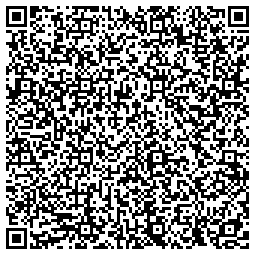

# QR Code Certificate Demo

This project demonstrates generating, encoding, and validating X.509 certificates using QR codes.

<p align="right">
  <a href="sample/"></a>
</p>

## Features

- Minimal ECDSA certificates (P-256)
- PEM certificates embedded directly in QR codes
- Validation using a custom CA

## Usage

A good starting point is to run:

```sh
./usage_example.sh
```

This script demonstrates the full workflow: certificate generation, QR code creation, and validation.

Or, follow the steps below manually:

1. **Generate a certificate:**
   ```sh
   ./cert_gen_script.sh 123456789012 365 "John Smith"
   ```
2. **Create a QR code from the certificate:**
   ```sh
   python3 qr_generator.py output/123456789012-cert.pem
   ```
3. **Validate the certificate from the QR code:**
   ```sh
   python3 qr_validator.py output/123456789012-qr.png
   ```

### Example invocation of usage_example.sh

```
Generate certificate...
Generating CA private key...
Generating CA certificate...
Certificate request self-signature ok
subject=CN=John Smith
Certificate generated: output/123456789012-cert.pem
        Serial Number: 123456789012 (0x1cbe991a14)
            Not Before: Sep 16 08:53:46 2025 GMT
            Not After : Sep 16 08:53:46 2026 GMT
        Subject: CN=John Smith
Certificate size: 579 bytes


Certificate details:
Certificate:
    Data:
        Version: 3 (0x2)
        Serial Number: 123456789012 (0x1cbe991a14)
        Signature Algorithm: ecdsa-with-SHA256
        Issuer: CN=Very authoritative certificate authority
        Validity
            Not Before: Sep 16 08:53:46 2025 GMT
            Not After : Sep 16 08:53:46 2026 GMT
        Subject: CN=John Smith
        Subject Public Key Info:
            Public Key Algorithm: id-ecPublicKey
                Public-Key: (256 bit)
                pub:
                    04:12:36:b1:7f:ca:62:26:67:27:04:f4:75:08:07:
                    32:49:c5:63:c7:48:f3:17:b1:27:cc:bc:f1:0b:ea:
                    e1:a5:a5:c0:08:08:12:47:09:47:f7:f9:b0:13:12:
                    6f:3d:e2:05:39:39:9b:84:3c:77:26:f6:00:e4:11:
                    6f:aa:0d:4c:53
                ASN1 OID: prime256v1
                NIST CURVE: P-256
        X509v3 extensions:
            X509v3 Subject Key Identifier: 
                E0:D7:36:4D:FF:CE:60:F4:51:80:8E:D8:B7:D1:44:28:93:C9:23:E0
            X509v3 Authority Key Identifier: 
                03:5D:C3:26:97:7D:5D:E3:DE:2D:07:D6:2D:68:32:FB:91:CA:8D:07
    Signature Algorithm: ecdsa-with-SHA256
    Signature Value:
        30:46:02:21:00:b8:53:ac:24:95:2e:79:4d:de:bf:8e:b3:f9:
        f7:7a:f6:ee:ca:e1:7a:1b:b5:d9:98:23:01:0a:cb:9a:ac:f2:
        bc:02:21:00:de:03:e6:42:8f:fa:5c:52:b2:15:03:d6:6a:94:
        40:0c:91:ae:3a:a7:a2:d2:7d:1f:53:1f:d2:b0:e7:5c:b6:0d


Generating QR code from certificate...
QR code saved to: output/123456789012-qr.png
Certificate size: 579 bytes (PEM)
QR version: 16


Validating certificate in QR code...
Scanning QR code from: output/123456789012-qr.png
QR code decoded successfully (579 characters)
[OK] Certificate signature VALID

==================================================
CERTIFICATE VALIDATION RESULTS
==================================================
Subject (CN): John Smith
Serial Number: 123456789012
Valid From: Sep 16 08:53:46 2025 GMT
Valid Until: Sep 16 08:53:46 2026 GMT
Status: [OK] Valid (364 days remaining)

Overall: [OK] VALID
```

## Requirements

- Python 3.8+
- OpenSSL
- zbar (for QR code scanning)
- See `requirements.txt` for Python dependencies

## Docker

A minimal Dockerfile is provided. Build and run:

```sh
docker build -t qr-cert .
docker run --rm -it qr-cert
```

To persist generated certificates and QR codes, mount the `output` directory as a volume:

```sh
docker run --rm -it -v "${PWD}/output:/app/output" qr-cert
```

## License

WTFPL
